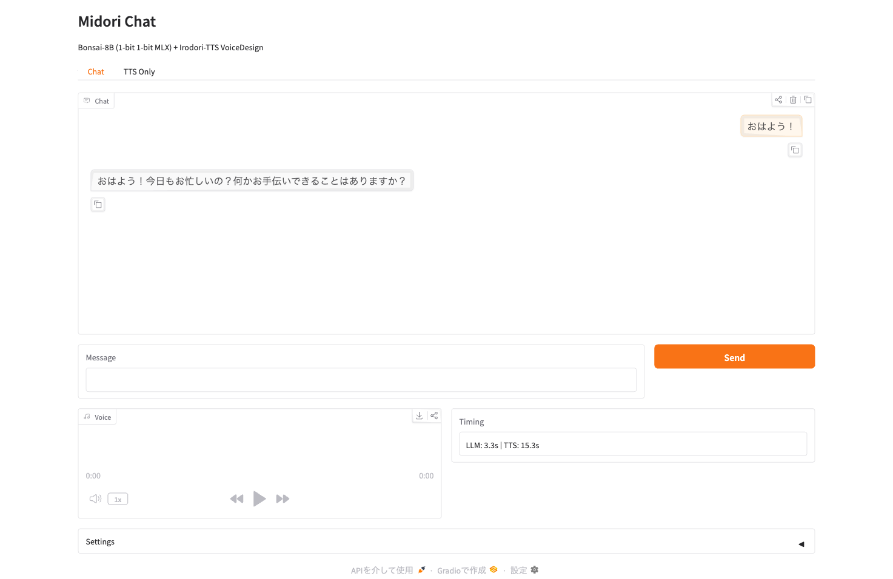

# irodori-bonsai

Local AI voice chat — [Bonsai-8B](https://huggingface.co/prism-ml/Bonsai-8B-mlx-1bit) (1-bit LLM) + [Irodori-TTS VoiceDesign](https://huggingface.co/Aratako/Irodori-TTS-500M-v2-VoiceDesign) (Japanese TTS).

Chat with "Midori", an AI assistant that talks back to you — entirely local, no cloud APIs needed. Runs on both Apple Silicon (MLX) and NVIDIA GPUs (CUDA via Docker Compose).



**Voice sample** — "おはよう！今日もお忙しいの？何かお手伝いできることはありますか？" (Irodori-TTS VoiceDesign, 15 steps)

https://github.com/kazuph/irodori-bonsai/raw/main/docs/sample.mp4

## Features

- **Bonsai-8B** — 1-bit quantized 8B LLM (1.15 GB model size)
- **Irodori-TTS VoiceDesign** — Flow Matching Japanese TTS, caption-controlled voice style
- **Web UI** — Gradio chat interface with auto voice playback
- **Cross-platform** — Apple Silicon (MLX + MPS) and NVIDIA GPU (CUDA via Docker Compose)
- **Fully local** — No cloud APIs needed

## Benchmark

Measured with 3 runs each, 15-step TTS, short Japanese prompts.

| | Apple M5 (MLX/MPS) | RTX 3090 (CUDA) |
|---|---|---|
| **LLM response** | 1.02s | 0.27s |
| **TTS generation** (~4s audio) | 13.59s | 0.84s |
| **Total per turn** | ~14.6s | ~1.1s |
| **LLM memory** | ~1.4 GB (unified) | ~1.9 GB (VRAM) |
| **TTS memory** | ~4 GB (unified, fp32) | ~2.5 GB (VRAM, bf16) |

> **Note:** TTS memory scales with step count. At 40 steps, TTS VRAM increases to ~6.7 GB on CUDA. Adjust TTS Steps in Settings based on your available memory (15 = fast/light, 40 = higher quality/heavier).

## Requirements

### Mac (Apple Silicon)

- macOS with Apple Silicon (M1/M2/M3/M4/M5)
- Python 3.12
- cmake (`brew install cmake`)
- Metal Toolchain (`xcodebuild -downloadComponent MetalToolchain`)

### Linux (NVIDIA GPU)

- Docker & Docker Compose
- NVIDIA GPU with CUDA support
- nvidia-container-toolkit

## Setup

### Mac (Apple Silicon)

```bash
# Install Metal Toolchain (one-time)
xcodebuild -downloadComponent MetalToolchain

# Run setup
bash setup_env.sh

# Activate and launch
source .venv/bin/activate
python webui_chat.py
```

Then open http://127.0.0.1:7860 in your browser.

### Linux (NVIDIA GPU via Docker Compose)

```bash
docker compose -f docker/docker-compose.yml up --build
```

Then open http://localhost:7861 in your browser.

## Usage

### Chat Tab
Type a message and press Send. Midori will respond in text and voice.

### TTS Only Tab
Enter any Japanese text to synthesize speech. Includes sample texts with emoji-based emotion control.

### Settings
- **Voice Caption** — Describe the voice style in Japanese (e.g., "落ち着いた女性の声で自然に読み上げてください")
- **TTS Steps** — 10-20 recommended (lower = faster, higher = better quality)
- **Auto TTS** — Toggle automatic voice synthesis

## Architecture

### Mac (Apple Silicon)

```
User Input → Bonsai-8B (MLX, Apple GPU) → Response Text
                                              ↓
                                    Irodori-TTS VoiceDesign (PyTorch MPS)
                                              ↓
                                    Audio Playback (browser autoplay)
```

### Linux (NVIDIA GPU via Docker Compose)

```
┌─────────────────────────────────────────────┐
│ Docker Compose                              │
│                                             │
│  ┌─────────────┐    ┌────────────────────┐  │
│  │ llm service │    │ app service        │  │
│  │ (llama.cpp  │◄───│ (Gradio + TTS)     │  │
│  │  1-bit CUDA)│    │ OpenAI API client  │  │
│  │ :8080       │    │ :7861 → :7860      │  │
│  └─────────────┘    └────────────────────┘  │
└─────────────────────────────────────────────┘
```

## Credits

- [Bonsai-8B](https://huggingface.co/prism-ml/Bonsai-8B-mlx-1bit) by PrismML — 1-bit quantized LLM
- [Irodori-TTS](https://huggingface.co/Aratako/Irodori-TTS-500M-v2-VoiceDesign) by Aratako — Flow Matching Japanese TTS
- [MLX](https://github.com/ml-explore/mlx) by Apple — ML framework for Apple Silicon
- [PrismML MLX fork](https://github.com/PrismML-Eng/mlx) — 1-bit MLX kernel support
- [PrismML llama.cpp fork](https://github.com/PrismML-Eng/llama.cpp) — 1-bit CUDA kernel support

## License

MIT
